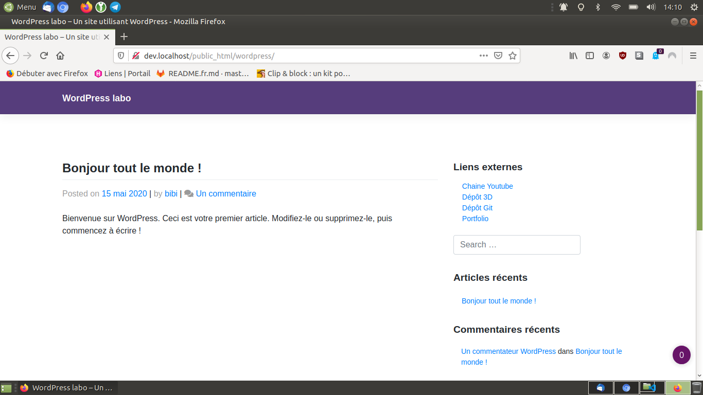

> **Description du projet**:

* * *

## Installation

Il est nécessaire

```shell
sudo apt-get installe quelque chose
```

## Paramétrage

```shell
sudo apt-get fait quelque chose
```

## Inspiration(s), source(s)

* [makeareadme](https://www.makeareadme.com/)

## License

[The Unlicense](https://choosealicense.com/licenses/unlicense/)

### Fin
