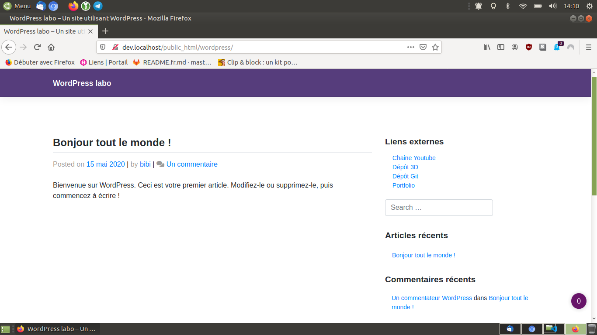

> **Description du projet**: Widget WordPress réalisé pour apprendre à développer un plugin, celui-ci affiche une liste de liens provenant d'un fichier `liens.json`.

Renommer si besoin dossier:

- widget_liens => widget_liens-master

* * *

## Inspiration(s), source(s)

* bibibricodeur

## License

[The Unlicense](https://choosealicense.com/licenses/unlicense/)

### Fin
